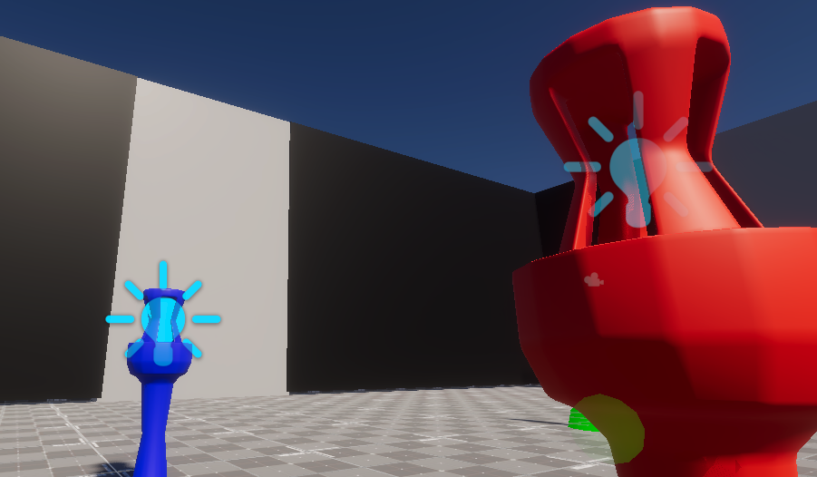

# Kiry's Shadow

This is a WIP please bare with changes. Thank You :)
---
Table of Contents
- [Unity Engine Version](#unity-engine-version)
- [Overview](#overview)
- [Features](#features)
- [Core Classes](#core-classes)
- [Features To Implement](#features-to-implement)
- [ScreenCaptures](#screen-captures)
- [Issues/Bugs](#issuesbugs)
---
# Unity Engine Version
|Engine|Version|
|------|-------|
|Unity| 6000.1.17f1|
---

# Overview
Trapped in this shadow maze, you must find a way to escape Kiry's Shadow before you become one with the shadow.
Help Astra navigate through this course and escape the grasp of Kiry.
---

# Features
- ## FNAF Style Cameras
    - Click on the buttons(UI) to switch camera positions/views.
    - Different angles of the puzzles.
- ## PlugNSocket Puzzle
  - A plug like object goes with a socket like object. (In the name)
  - Both the plug and socket are color coded, so each color goes to its respected color.
  - The plug has PHYSICS!!
  - Get plugs into the sockets to open up the main door.
- ## Button & Door (Gates) System
    - A button has been added.
    - You push the button, (It has working animations(programmed)).
    - Can move doors (gates) in game up and down (locked/unlocked).
- ## Lever System
    - A lever has been added.
    - You can pull the lever down (It has working animation(programmed)).
    - Can destroy/remove objects.
    - Will have an additional use later.
---

# Core Classes

---

# Features to Implement
- ## Levels/Different Areas for Puzzles
- ## Smoother Camera Transition
- ## N/A Camera Screen
- ## Polish UI Elements
- ## Secret Ending Levers
---

# Screen Captures

---

# Issues/Bugs
No bugs or issues so far :)
---
